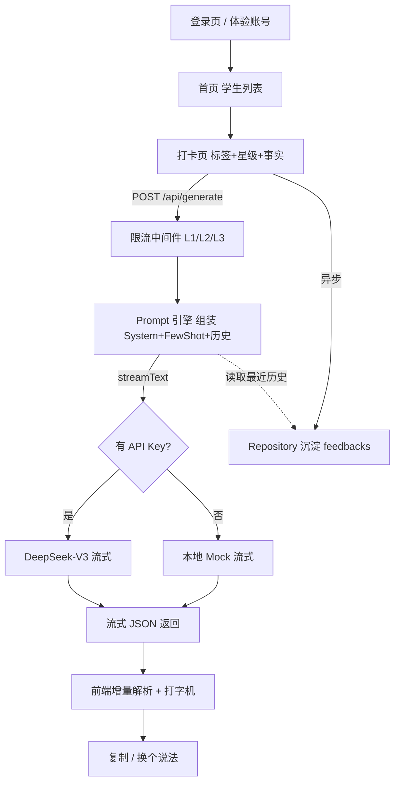

## 用户需求

基于 EduVibe / 暖评 AI PRD v1.1，从零搭建一款面向全品类教培工作者的移动端响应式 AI 点评生产力 Web App（MVP）。核心目标：将单次课后反馈撰写从 3 分钟压缩到 30 秒内，通过"结构化标签 + 三明治防幻觉 Prompt 引擎"生成高情商、零幻觉的家长/学员反馈。

## 产品概览

一款移动优先的轻量工具：教师/教务用体验账号一键登录，管理名下学生（仅姓名 + 一句话性格底色，不绑定学科），在打卡页点选动态分类标签、评定双维度星级、记录一句话事实，点击生成后由 AI 流式输出"微信长文 + 语音脚本"双模态结果，可一键复制或直接换说法重生成。

## 核心功能

- 体验账号一键免密登录（邮箱验证码登录预留接口，配置 SMTP 后启用）
- 学生列表：卡片默认仅展示学生姓名（不第一时间显示性格底色）；性格底色收进"学生档案"，通过卡片上的档案入口以小字或档案弹层查看；支持新建/编辑（姓名 + 性格底色），彻底解耦学科
- 动态标签矩阵：5 类分类 Tab（通用习惯/理科表现/文科表现/素质艺术/成人教育）横向滑动切换、隐藏滚动条；标签字典前端硬编码；末尾固定"自定义标签"按钮，追加到用户自定词库并持久化
- 双维度星级评分：课堂专注度、课堂吸收度各 1-5 星，热区 >=44px
- 无极自适应高文本框：随内容平滑向下扩展，无字数上限，软键盘弹出时滚动至可视区中心
- 抗幻觉三明治 Prompt 引擎：后端组装系统指令（三明治法 + 三层反幻觉红线）+ 硬编码 Few-Shot 金牌语料 + 学生性格底色与最近一条历史评价（无状态 Context 增强），调用 LLM 流式返回
- 双模态流式输出：微信长文 80-120 字、语音脚本 50-70 字，前端打字机效果渲染，深灰正文色提升阅读舒适度
- 快捷操作：一键复制（剪贴板 API + Toast）、换个说法（携带 context 重新流式请求）
- 轻量增强：历史记忆召回（读该生最近一条反馈增强语气连续性）、三级阶梯风控（L1 匿名 IP 20 次/天硬阻断、L2 注册账号 200 次/天、L3 第 201 次柔性弹窗引导加开发者微信）、跨表数据隔离（应用层按 teacher_id 过滤）

## 技术栈选型

- 前端框架：Next.js 14（App Router）+ React 18 + TypeScript
- 样式体系：Tailwind CSS + shadcn/ui（UI 组件库）+ Lucide React（图标）
- 数据存储：本地文件仓储（基于 fs 的 JSON 持久化，封装为 Repository 接口）——零原生依赖、Windows 下 `npm run dev` 即跑；预留 Supabase 适配层便于后续替换
- 鉴权：内置体验账号（HttpOnly Cookie 会话）+ 邮箱 OTP 接口（配置 SMTP 后启用，未配置时隐藏入口）
- AI 引擎：Vercel AI SDK（`ai` + `@ai-sdk/deepseek`，可切 `@ai-sdk/openai`），`streamText` 流式；provider 抽象，未配置 Key 时本地 mock 生成器兜底保证可演示
- 限流：本地文件计数器，按自然日重置（IP 匿名 / 注册用户分层）

## 实现方案

采用单一全栈 Next.js（App Router）架构，前端页面与 API Route 同仓。核心策略：

1. **数据层抽象**：定义 `DataRepository` 接口（profiles/students/feedbacks/custom_tags/rate_limit），先用 `FileStoreRepository`（JSON 文件）实现，后续可加 `SupabaseRepository` 无缝替换，业务代码零改动。
2. **Prompt 引擎分层**：`lib/prompt.ts` 集中管理 System Instruction（三明治法 + 三层反幻觉红线）+ 补全后的 Few-Shot 语料库（补全素质艺术、成人教育、文科等范例）；`/api/generate` 负责组装 user message（学生性格底色 + 最近历史 + 当前标签/星级/事实）并调用 `streamText`。
3. **流式 JSON 渲染**：系统要求返回 `{wechat_text, voice_script}` JSON。采用"流式整体返回文本 → 前端增量解析（容错截断 JSON）→ 双字段分别打字机渲染"方案，避免两次请求，兼顾流式体验与结构化输出。
4. **零幻觉保障**：在 System Prompt 固化三条红线（禁捏造具体场景、用中性过渡词、禁虚假承诺），并在后端拼接时只注入用户输入与性格底色/历史，绝不编造事实。
5. **轻量风控**：API Route 前置中间件按身份计数，命中 L1 返回 403、L2 超 200 仍放行、L3 第 201 次返回 429 + 自定义体，前端弹柔性转化弹窗。

性能与可靠性：TTFB 目标 <1.5s，请求发出即展示骨架屏；mock 生成器本地即时返回便于演示与测试；文件仓储在写入时串行化避免并发损坏；所有外部 Key 走环境变量，缺省安全降级。

## 实现要点（防回归）

- 复用同一 `DataRepository` 接口，避免多处直接读写文件造成数据不一致
- 自定义标签写入 `profiles.custom_tags` 并持久化；前端同时用 localStorage 记忆最后一次 Tab 定位（PRD 要求）
- 流式解析需对"未闭合 JSON"做容错，避免渲染闪烁或崩溃
- 限流计数按 UTC 自然日重置，防止计数无限增长
- 跨表隔离统一在 Repository 查询层按 `teacher_id` 过滤，等同 RLS 效果，避免越权读他人学生/反馈
- 邮件 OTP 仅在检测到 SMTP 配置时暴露入口，否则仅体验账号可用
- 日志复用 Next.js 默认 console，避免打印 Key 与学生隐私

## 架构设计



## 目录结构

```
## 目录结构说明
全新 Next.js 项目，从零搭建。所有文件均为新建。

eduvibe/  (工作区根)
├── package.json                 # [NEW] 依赖与脚本：next/react/ts/tailwind/shadcn/ai/deepseek/lucide
├── tsconfig.json                # [NEW] TypeScript 配置（含路径别名 @/*）
├── next.config.mjs              # [NEW] Next.js 配置
├── tailwind.config.ts           # [NEW] Tailwind 配置（移动优先断点、主题色）
├── postcss.config.mjs           # [NEW] PostCSS 配置
├── .env.example                 # [NEW] DEEPSEEK_API_KEY / SMTP 等占位说明
├── .gitignore                   # [NEW] 忽略 node_modules、.data、.env
├── README.md                    # [NEW] 运行说明 + 后续接入 Supabase 指引
├── components.json              # [NEW] shadcn/ui 配置文件
├── data/                        # [NEW] 本地 JSON 持久化目录（运行时生成，gitignore）
├── src/
│   ├── app/
│   │   ├── layout.tsx           # [NEW] 根布局：字体、全局样式、移动端 viewport/安全区
│   │   ├── globals.css          # [NEW] Tailwind 指令 + 隐藏滚动条 + 安全区样式
│   │   ├── page.tsx             # [NEW] 入口重定向（未登录→登录，已登录→首页）
│   │   ├── (auth)/
│   │   │   └── login/page.tsx   # [NEW] 登录页：体验账号一键免密 + 邮箱 OTP 入口（配置后显示）
│   │   ├── home/page.tsx        # [NEW] 学生列表页：卡片展示、新建/编辑学生弹窗
│   │   ├── student/[id]/page.tsx# [NEW] 打卡页：动态标签矩阵 + 双维度星级 + 无极文本框 + 生成按钮 + 结果区
│   │   └── api/
│   │       ├── auth/
│   │       │   ├── experience/route.ts  # [NEW] 体验账号登录/登出（签发会话 Cookie）
│   │       │   └── otp/route.ts         # [NEW] 邮箱 OTP 发送/校验（SMTP 配置后启用）
│   │       ├── generate/route.ts        # [NEW] 核心 AI 路由：限流→Prompt 组装→streamText→流式 JSON
│   │       └── feedbacks/route.ts       # [NEW] 反馈沉淀与按学生读取（含历史召回，teacher_id 过滤）
│   ├── components/
│   │   ├── ui/                  # [NEW] shadcn 基础组件（button/card/dialog/toast/input 等）
│   │   ├── TagMatrix.tsx        # [NEW] 横向滑动分类 Tab + 标签池 + 自定义标签，隐藏滚动条
│   │   ├── StarRating.tsx       # [NEW] 双维度 1-5 星评分，热区 >=44px
│   │   ├── AutoTextarea.tsx     # [NEW] 无极自适应高度文本框 + scrollIntoView
│   │   ├── ResultPanel.tsx      # [NEW] 双模态流式打字机渲染 + 复制/换个说法 + 骨架屏
│   │   ├── StudentCard.tsx      # [NEW] 学生卡片：默认仅显示头像首字 + 姓名，含档案入口（查看性格底色，不默认展示）
│   │   ├── StudentDialog.tsx    # [NEW] 新建/编辑学生弹窗（姓名+性格底色）
│   │   ├── StudentProfileDialog.tsx # [NEW] 学生档案弹层：以小字展示性格底色等档案信息（从卡片档案入口唤起）
│   │   ├── RateLimitDialog.tsx  # [NEW] L3 柔性转化弹窗（加开发者微信）
│   │   └── Toast.tsx            # [NEW] 轻量 Toast 提示
│   └── lib/
│       ├── db.ts                # [NEW] DataRepository 接口 + FileStoreRepository（JSON 持久化）
│       ├── auth.ts              # [NEW] 会话管理（Cookie 签发/校验）+ 体验账号 + OTP 接口封装
│       ├── ratelimit.ts         # [NEW] 三级限流计数器（按日重置，IP/用户分层）
│       ├── tags.ts              # [NEW] 5 类标签字典硬编码 JSON + 分类元数据
│       ├── prompt.ts            # [NEW] System Instruction（三明治+反幻觉红线）+ 补全 Few-Shot 语料
│       ├── ai.ts                # [NEW] provider 抽象（DeepSeek/GPT/mock）+ streamText 封装
│       └── types.ts             # [NEW] Profile/Student/Feedback/GenerateRequest 等类型
```

## 关键代码结构（接口级）

```ts
// src/lib/types.ts
export interface Student { id: string; teacherId: string; name: string; backgroundNote?: string; createdAt: string; }
export interface FeedbackRecord { id: string; studentId: string; rawInput: string; aiGenerated: { wechat_text: string; voice_script: string }; createdAt: string; }
export interface GenerateRequest { studentId: string; tags: string[]; focusStars: number; absorbStars: number; fact: string; regenerate?: boolean; }

// src/lib/db.ts
export interface DataRepository {
  listStudents(teacherId: string): Promise<Student[]>;
  upsertStudent(s: Partial<Student> & { teacherId: string }): Promise<Student>;
  deleteStudent(id: string, teacherId: string): Promise<void>;
  appendCustomTag(teacherId: string, tag: string): Promise<string[]>;
  saveFeedback(studentId: string, raw: string, ai: { wechat_text: string; voice_script: string }): Promise<FeedbackRecord>;
  latestFeedback(studentId: string): Promise<FeedbackRecord | null>;
}
```

## 设计风格

采用"温暖极简（Warm Minimalism）"风格，呼应产品名"暖评 AI"的温情定位。移动优先（375px 基准），整体以暖奶油底色 + 柔和暖橙渐变点缀，卡片采用轻量圆角玻璃质感，营造专业又有温度的教师工具氛围。交互借鉴小红书首页的平滑分类滑动，Tab 隐藏滚动条、切换无阻尼；结果区采用深灰正文（#333333）与段落间距提升长文阅读舒适度；核心按钮热区均 >=44px，配合微动效（点击缩放、流式打字机光标、卡片悬浮微抬升）增强生命力。

## 页面规划（3 个核心视窗）

1. **登录页**：居中暖色品牌区 + 体验账号一键登录大按钮 + 可选邮箱入口；背景柔和暖渐变与模糊光斑。
2. **学生列表页（首页）**：顶部品牌栏 + 学生卡片列表（头像首字 + 姓名，性格底色默认不显示，通过卡片上的档案入口以小字/弹层查看）+ 右下悬浮新建按钮（FAB，>=44px）。
3. **打卡页（核心）**：顶部学生名 + 返回；中部 5 类横向滑动 Tab + 标签药丸（选中态暖橙填充）；双维度星级行；无极自适应文本框；底部固定"生成反馈"主按钮（流式时变骨架/加载）；下方结果面板双模态卡片（微信长文/语音脚本）+ 复制/换个说法操作栏；超限时弹出转化对话框。

## 关键区块（打卡页自上而下）

- 顶部导航：学生姓名 + 返回箭头，可点开"档案"查看性格底色（以小字呈现），固定毛玻璃栏
- 分类 Tab 矩阵：横向滑动、隐藏滚动条、选中下划线动效
- 标签池：药丸标签多选，末尾"自定义标签"按钮触发输入
- 双维度星级：两个独立星级行，含标签说明
- 事实输入框：无极自适应高度，占位符温情文案
- 生成按钮区：主按钮 + 加载骨架
- 结果面板：双卡片流式打字机 + 操作栏

## 已锁定决策（用户确认，2026-07-28）

- **登录方式**：体验账号一键免密为主；邮箱验证码 OTP 入口隐藏，待配置 SMTP 后启用（首版不强制）。
- **品牌名**：暖评 AI（EduVibe 作代号）；主色暖橙 `#F97316` + 暖奶油底 `#FFF8F3`。UI 视觉细节用户要求"随后讨论"，首版先按"温暖极简(Warm Minimalism)"默认风格落地，后续可微调。
- **AI 模型**：暂用本地 mock 生成器兜底（开箱即演示）；DeepSeek API Key 由用户后续提供并写入 `.env` 即切真实模型（按量计费、无需订阅，成本极低）。
- **L3 柔性弹窗联系方式**：`Surge_forward_`（用户真实联系方式，写入弹窗文案）。
- **示例学生/标签/星级释义/文本框占位**：采用计划默认（PRD 占位数据 + 5 类 30 标签 + 专注度=态度/吸收度=效果 + PRD 温情占位文案），用户可随时补充。